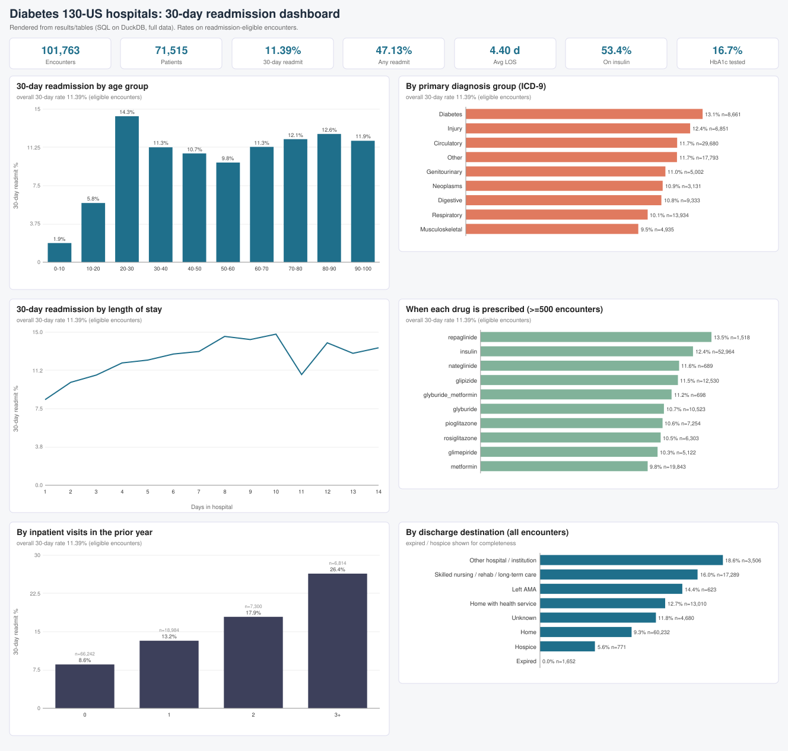
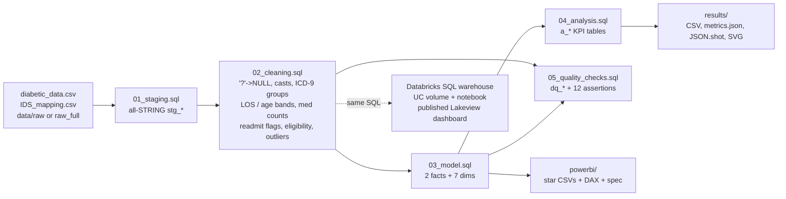

# da-learn-08 - Hospital readmissions (Diabetes 130-US hospitals): SQL cleaning -> star schema -> KPIs -> dashboards

**Data Analyst learning series, project 08.** An end-to-end analyst workflow on the real **Diabetes 130-US Hospitals
for Years 1999-2008** dataset (UCI ML Repository #296; 101,766 inpatient encounters, 71,518 patients, 50 columns):
SQL data cleaning, a star schema, readmission KPIs by **age, diagnosis, length of stay and medications**, data-quality
evidence, a **live Databricks run + published Lakeview dashboard**, and a **Power BI kit**.

* SQL is written in the **Databricks / Spark SQL dialect** and runs locally on **DuckDB** (one-macro shim file).
* Every number below comes from the **full dataset** run. Git holds a reproducible 153-encounter sample (see [Complete dataset](#complete-dataset)).
* The same SQL ran on a Databricks serverless SQL warehouse: **all 13 table row counts and 8 compared result tables match DuckDB exactly**.



## Business questions
1. What share of diabetic inpatient encounters is readmitted within 30 days (the CMS penalty window), and how many are readmitted at all?
2. How does 30-day readmission vary by **age group**?
3. Which **primary diagnoses** (ICD-9 chapters) carry the highest readmission risk and volume?
4. Does a longer **length of stay** go with more or fewer readmissions?
5. Which **diabetes medications** / dose changes (insulin up/down) go with higher readmission?
6. How strongly do **prior inpatient visits** and **discharge destination** predict readmission?
7. How clean is the source (missing codes, invalid genders, expired patients, repeat patients)?

## Pipeline


## Key insights (full data, readmission-eligible encounters)
| # | Insight |
|---|---|
| 1 | **11.39 % 30-day readmission** (11,314 of 99,340 eligible encounters); **47.13 %** are readmitted at some point. Counting only each patient's first encounter the 30-day rate falls to **8.97 %** - repeat patients inflate the headline. |
| 2 | **Prior utilisation is the strongest signal:** 0 inpatient visits in the prior year -> **8.59 %**, 1 -> **13.25 %**, 2 -> **17.93 %**, 3+ -> **26.4 %** (3x the baseline). 10.3 % of encounters come from the 1,590 patients with 5+ stays. |
| 3 | **Length of stay rises with risk:** 1-2 days **9.33 %** vs 8-14 days **13.85 %** (1 day 8.39 %, 10 days 14.81 %). **Age:** 20-30 year-olds are highest (**14.31 %**), 50-60 lowest of adults (**9.77 %**), 80-90 **12.57 %**. |
| 4 | **Diagnosis, medication and discharge:** primary diabetes diagnosis **13.1 %** vs respiratory **10.06 %** and musculoskeletal **9.54 %**; circulatory is the largest group (29.88 % of encounters, 11.69 %). Insulin dose **Down 14.22 %** / **Up 13.33 %** vs no insulin **10.21 %**; metformin users **9.77 %**. Discharge to another hospital **18.57 %** or SNF/rehab **16.0 %** vs home **9.3 %**. HbA1c was measured in only **16.72 %** of encounters. |

Full tables: [`results/RESULTS.md`](results/RESULTS.md), `results/tables/*.csv`, `results/metrics.json`.

## Data cleaning (sql/02_cleaning.sql) - full-data counts
| Step | Result |
|---|---|
| `'?'` / `'None'` / `'Unknown/Invalid'` -> NULL or explicit category; `TRY_CAST` on 20 numeric columns | weight 96.86 % missing, medical_specialty 49.08 %, payer_code 39.56 %, race 2.23 % (kept as NULL) |
| Standardise: age `[70-80)` -> `70-80` + `age_mid`; `AfricanAmerican` -> `African American`; A1C / glucose `None` -> `Not measured`; `Ch`/`Yes` -> 0/1 flags | 10 age groups |
| Dedupe on `encounter_id` with `ROW_NUMBER()` | 0 duplicates found |
| Integrity filters: valid gender, age, readmitted label, LOS 1-14, ids present | 101,766 -> **101,763** (3 Unknown/Invalid gender) |
| ICD-9 grouping of diag_1..3 (Strack et al. 2014 chapters) | 10 groups; 1,645 V/E supplementary codes -> Other |
| Medications: 23 drug columns -> counts (`n_diabetes_meds`, `n_meds_changed`) + long table | 120,050 encounter x drug rows |
| Readmission eligibility: expired / hospice discharges (ids 11, 13, 14, 19-21) excluded from rates | 2,423 encounters excluded -> 99,340 eligible |
| Patient sequence: `patient_encounter_seq` by encounter_id | 30,248 repeat encounters, 16,773 patients with > 1 stay |
| Outlier flags (Q3 + 3 x IQR, kept) | 430 num_medications outliers, 0 lab outliers |
| Star schema (03) | fact_encounter 101,763; fact_encounter_medication 120,050; dim_patient 71,515; 6 small dims |
| Assertions (05) | **12 / 12 PASS** (unique keys, all FKs resolve, seeded lookups exist verbatim in IDS_mapping.csv, label domains) |

## How to run
```bash
pip install -r requirements.txt
python run_pipeline.py --source sample          # 153-encounter sample in git -> powerbi/data, results/sample
python scripts/download_full_data.py            # full UCI zip -> data/raw_full (SHA-256 verified)
python run_pipeline.py --source full            # -> data/clean_full, results/ (tables, metrics.json, JSON.shot, charts)
python scripts/build_databricks.py              # regenerate notebook + Lakeview JSON from sql/
export DATABRICKS_HOST=https://<workspace>.cloud.databricks.com DATABRICKS_TOKEN=...   # optional live run
python scripts/databricks_deploy.py             # upload -> run -> compare -> publish dashboard -> export
```
* Databricks details: [`databricks/SETUP.md`](databricks/SETUP.md). Power BI: [`powerbi/BUILD_GUIDE.md`](powerbi/BUILD_GUIDE.md).

## Databricks run (2026-10-02, IST)
| Object | Location |
|---|---|
| Raw CSVs (full) | UC volume `/Volumes/workspace/da_learn_08/raw/` (diabetic_data.csv 19,159,383 B, IDS_mapping.csv 2,547 B) |
| Tables | `workspace.da_learn_08` (stg_*, cln_*, fact_*, dim_*, a_*, dq_*) |
| Notebook | `/Workspace/Shared/da-learn-08-healthcare-hospital-readmissions/readmissions_pipeline_notebook` |
| Dashboard (**published**) | **"da-learn-08 Hospital readmissions"** - 2 pages, 2 counters + 6 charts |
| Warehouse | Serverless Starter Warehouse (45 statements, 231 s) |

DuckDB vs Databricks: 13 / 13 row counts identical; `a_kpi_headline`, 5 analysis tables, `dq_issues`, `dq_assertions` - 0 cell differences.
See `databricks/run_outputs/duckdb_vs_databricks.json`.

## Repo layout
```
run_pipeline.py               # runs sql/00..05 on DuckDB, exports CSV/JSON, renders SVG charts
sql/00_duckdb_compat.sql      # DuckDB-only shim (percentile_approx) - skip on Databricks
sql/01_staging.sql            # raw CSV -> all-STRING stg_encounters, stg_ids_mapping
sql/02_cleaning.sql           # cln_encounters, cln_encounter_medications
sql/03_model.sql              # fact_encounter, fact_encounter_medication + 7 dims
sql/04_analysis.sql           # a_* KPI / business-question tables
sql/05_quality_checks.sql     # dq_row_counts, dq_null_rates, dq_issues, dq_assertions
scripts/project.py            # project config (files, star tables, JSON.shot, Databricks + dashboard definition)
scripts/download_full_data.py # full data from UCI + SHA-256 check
scripts/make_sample.py        # deterministic sample -> data/raw
scripts/make_charts.py        # SVG charts + dashboard (svgcharts.py = pure-vector chart helpers)
scripts/build_databricks.py   # notebook + .lvdash.json generator (lakeview.py helpers)
scripts/databricks_deploy.py  # live Databricks run, comparison, dashboard publish + export
data/raw/                     # sample CSVs (+ data/README.md)
databricks/                   # exported notebook, exported .lvdash.json, run_outputs/, SETUP.md
powerbi/                      # data/ (star CSVs, sample-sized), measures.dax, model.md, dashboard_spec.md, BUILD_GUIDE.md
results/                      # RESULTS.md, metrics.json, JSON.shot, charts/*.svg, tables/*.csv, sample/
```

## Limitations
* De-identified 1999-2008 data, no calendar dates: encounter order uses `encounter_id`; "readmitted" is the source label (any later inpatient stay), not a CMS-adjudicated measure.
* Rates are descriptive associations, not causal or risk-adjusted (e.g. insulin dose changes mark sicker patients).
* `weight` (97 % missing) and `payer_code` / `medical_specialty` (40-49 % missing) are not used as drivers.

Data licence: CC BY 4.0 (UCI). Code: MIT.

## Complete dataset
| | |
|---|---|
| Kaggle page | https://www.kaggle.com/datasets/brandao/diabetes |
| Original source | UCI ML Repository #296 - https://archive.ics.uci.edu/dataset/296/diabetes+130-us+hospitals+for+years+1999-2008 |
| Mirror URL (used) | https://archive.ics.uci.edu/static/public/296/diabetes+130-us+hospitals+for+years+1999-2008.zip |
| Licence | **Creative Commons Attribution 4.0 International (CC BY 4.0)**; cite Strack et al., BioMed Research International 2014, 781670 |
| Total size | zip 3,170,254 B; unzipped 19,161,930 B (~18.3 MB) |
| File list | `diabetic_data.csv` - 19,159,383 B, 101,766 rows x 50 columns (encounter_id, patient_nbr, race, gender, age, weight, admission_type_id, discharge_disposition_id, admission_source_id, time_in_hospital, payer_code, medical_specialty, num_lab_procedures, num_procedures, num_medications, number_outpatient, number_emergency, number_inpatient, diag_1-3, number_diagnoses, max_glu_serum, A1Cresult, 23 medication columns, change, diabetesMed, readmitted); `IDS_mapping.csv` - 2,547 B, 3 stacked lookups (admission type 8, discharge disposition 30, admission source 25) |
| Download | `python scripts/download_full_data.py` -> `data/raw_full/` (both files SHA-256 verified) |
